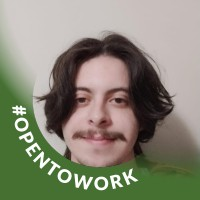

# **Grupo 01 - 16° Vem Ser**

Repositório para praticar os básicos do Git e GitHub.

# Nossa Equipe

## Daniele Lins

 

[ ](https://github.com/daniele-lins)
**Trilha:** Dados. 
**Idade:** 20 anos.

## 🎯 **Hobbies:**

- 🎮 Jogar videogame;
- 📺 Assistir animes e séries;
- 📖 Ler mangás;
- 🏊‍♀️ Praticar esportes aquáticos;
- 🍻 Participar de festas com amigos.

## Francinaldo Batista

 

[ ](https://github.com/Batissta)
**Trilha:** Quality Assurance. 
**Idade:** 20 anos. 
**Natural de:** Campina Grande, PB

## 🎯 Hobbies

- 📚 **Leitura**: Por mais que atualmente esteja enferrujado, gosto demais de ler livros, principalmente de filosofia. Aprendo muito com os livros.
- 🎧 **Música**: A música sempre está presente na minha rotina. Gosto demais de ouvir algum som em diversos momentos do dia.
- 🌱 **Aprender**: Sempre estou buscando aprender algo novo e aprimorar os meus conhecimentos no que já sei.
- ☕ **Filmes e Séries**: Gosto muito de assistir filmes e séries no meu tempo livre.

## Gabryell Leal

 

[ ](https://github.com/lealgabryell)
**Trilha:** Quality Assurance. 
**Idade:** 23 anos. 
**Natural de:** Campina Grande, PB

## 🎯 Hobbies

- ⚽**Futevôlei**: sempre em busca de bons livros, principalmente sobre desenvolvimento pessoal, tecnologia e ficção científica.
- 🎧 **Música**: gosto de conhecer novas playlists, apesar de sempre acabar voltando às raízes do meu Spotify.
- 🎮 **Games**: Gosta de jogos competitivos, nunca fui de fato bom em nenhum, sou sempre na média.
- 🏋️ **Academia**: Estudar e praticar exercícios físicos é uma coisa que me cativa.

## Vitor Conti

 

[ ](https://github.com/VitorContiFideles)
**Trilha:** Quality Assurance. 
**Idade**: 23 anos. 
**Natural de**: São Paulo, SP

## 🎯 **Hobbies**

- 📚 **Leitura**: sempre em busca de bons livros, principalmente de terror, investigação e ficção científica.,
- 🎧 **Música**: explorar playlists, gosto da descoberta de artistas menos conhecidos, gosto de tocar violão e gaita também.,
- 🎮 **Games**: Adoro jogos casuais com narrativas imersivas, mas também curto uma boa dose de competição!,
- 🌱 **Aprendizados contínuos**: estou sempre estudando algo novo, principalmente novos idiomas.,
- ☕ **Culinária**: Cozinhar me traz paz,

  Esses momentos me ajudam a manter o foco, a criatividade e a leveza no dia a dia profissional.
