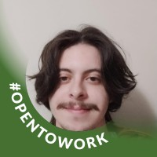

# **Grupo 01 - 16° Vem Ser**

Repositório para praticar os básicos do Git e GitHub.

## Sobre Nossa Equipe

### Daniele Lins

[ ](https://github.com/daniele-lins)
**Trilha:** Dados.

---

### Francinaldo Batista

[ ](https://github.com/Batissta)
**Trilha:** Quality Assurance.

---

### Gabryell Leal

[ ](https://github.com/lealgabryell)
**Trilha:** Quality Assurance.

---

### Vitor Conti

[ ](https://github.com/VitorContiFideles)

**Trilha:** Quality Assurance.
🎯 ****Hobbies****
- 📚 ****Leitura****: sempre em busca de bons livros, principalmente de terror, investigação e ficção científica.,
- 🎧 ****Música****: explorar playlists, gosto da descoberta de artistas menos conhecidos, gosto de tocar violão e gaita também.,
- 🎮 ****Games****: Adoro jogos casuais com narrativas imersivas, mas também curto uma boa dose de competição!,
- 🌱 ****Aprendizados contínuos****: estou sempre estudando algo novo, principalmente novos idiomas.,
- ☕ ****Culinária****: Cozinhar me traz paz,
**Idade**: 23 anos.
**Natural de**: São Paulo, SP
Esses momentos me ajudam a manter o foco, a criatividade e a leveza no dia a dia profissional.